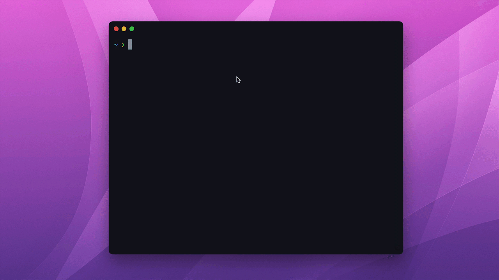

<div align="center">
  
</div>

<br />

# Create AdonisJS App
> AdonisJS Typescript starter template

This is the official starter template to create AdonisJS applications. You can choose between one of the following boilerplates

- **api**: Project structure + dependencies tailored for creating a REST API server.
- **web**: Traditional web application with server rendered templates and pre-configured support for sessions.
- **slim**: A smallest possible AdonisJS application. Still way powerful and feature rich then an Express application.

## Creating a new app

```sh
npm init adonis-ts-app hello-world
```

Yarn users

```sh
yarn create adonis-ts-app hello-world
```



## Options

Execute the following command to see the help output and available options

```sh
npm init adonis-ts-app
```

```
    _       _             _         _     
   / \   __| | ___  _ __ (_)___    | |___ 
  / _ \ / _` |/ _ \| '_ \| / __|_  | / __|
 / ___ \ (_| | (_) | | | | \__ \ |_| \__ \
/_/   \_\__,_|\___/|_| |_|_|___/\___/|___/

npm init adonis-ts-app <project-name>

Options
--boilerplate [api, web, slim]    Select the project boilerplate
--name <string>                   Specify application name
--eslint <boolean>                Enable/disable eslint setup
--prettier <boolean>              Enable/disable prettier setup
--encore <boolean>                Enable/disable encore setup
--debug <boolean>                 Turn on the debug mode
```

#### boilerplate

Choose the boilerplate by passing the flag

```sh
npm init adonis-ts-app hello-world --boilerplate=web
```

#### name

Define the application name. The `name` property inside the `package.json` file will reflect this value

```sh
npm init adonis-ts-app hello-world --boilerplate=my-app
```

#### eslint

Configure eslint

```sh
npm init adonis-ts-app hello-world --eslint
```

#### prettier

Configure prettier

```sh
npm init adonis-ts-app hello-world --prettier
```

#### encore

Configure encore

```sh
npm init adonis-ts-app hello-world --encore
```

#### debug

Debug the project creation process. This flag will use the verbose output for better debugging experience.

```sh
npm init adonis-ts-app hello-world --debug
```